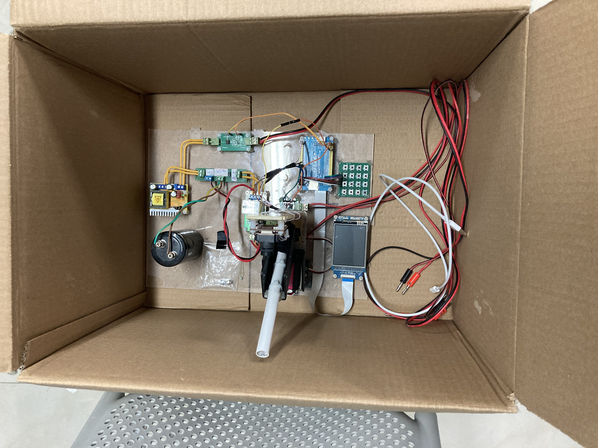

# 校电赛模拟电磁曲射炮（19年国赛H题）代码工程以及不详细且效果不太好的题解

## 试题

试题可在根目录找到，任务大致分为能射出、给定距离射击、给定距离和角度设计、30秒内自动搜寻标识射击、10秒内全角度扫描射击，权重为1:1:3:2:2。具体细节可查看试题

## 硬件搭建

如图 

## 硬件选择

基本上有啥用啥，勿杠，别问我为啥有更优不用（狗头）

### 主控板

来自正点原子的STM32F4 Core Board。因为使用了并口屏，需要FSMC/FMC外设，需要一个100pin及以上的STM32。刚好有这个（还是队友的板子），就用了。

### 视觉模块

来自星瞳科技代理的OpenMV。队友写的代码。这题要求不高，随意吧。个人感觉OpenMV性能还是有点羸弱，micropython对python各种特性的支持也不是很完整，为了帧率开低分辨率对测距还是有一定影响的，虽然实测还可以。注意框选识别范围，不然容易有奇奇怪怪的干扰，识别到各种光照。同时也要准备好多个色域阈值，方便验收前调试时选择合适的色域阈值。

### 输入设备

这里使用了矩阵键盘，因为据说电容屏和电阻屏都会受到电磁炮线圈瞬间放电的影响导致漂移，反正矩阵键盘够用。

### 显示设备

用了块原子的2.8寸的屏幕。并口屏，速度快。

### 充电电路

前端一个MOS管控制12V的通断，后面跟一个~~tb爆款~~升压模块。一两百V的东西，自己做boost总归不放心。（笑）

### 继电器模块

实测 [tb爆款继电器模块](https://detail.tmall.com/item.htm?spm=a230r.1.14.23.e4256122zf1UZY&id=41231430731&ns=1&abbucket=4) 不太行，发射两三次就粘住了，常开脚和公共脚短路。当然可以敲一敲继电器让他脱离。我们使用的是稍微大一点的继电器，外形类似于[这个](https://item.szlcsc.com/88169.html) ，脚位略有不同。虽然参数也挺一般，但是透明探索版~~好看~~容易观测是否粘连。似乎给线圈加上续流二极管也能防止粘连（暂未控制变量测试过，只是感觉，因为后面没粘连过）。

关于使用晶闸管/可控硅的方案，我们没做，隔壁组做了一个第一次试射晶闸管背部铁片就起泡了，不知是没加散热片的原因还是他们打开方式不太对，反正我们这几组都没用晶闸管的方案。

### 电容

慎用拆机电容，我觉得我们本次翻车就在这。拆机电容可能容量不稳定，可能会造成放置几天后容量变化射程变化，多次放电后容量变化射程变化等问题（当然新买的似乎也可能会发生这种问题）。有好的方案和建议欢迎issue。

本次使用1000uF电容，充电4s基本达到满电（充电电流从3A降至约0.1A），自己测试时使用165V电压，测评验收时调至175V电压射程才正常。

### 线圈

队友缠的，不太了解，似乎大概是0.6mm的线缠了300圈（待和队友进一步核实）

加了一个续流二极管，据指导老师说上个1A半的FR157就够，我们上了个[MURF2040CT](https://item.szlcsc.com/486071.html) 加散热片，老用牛刀了（笑）

### 炮弹

炮弹似乎不能和炮管直径过于接近，会导致产生负压（大概，听声音猜的），可能会影响到初速度。

### 云台

云台我们使用了两个舵机。我们的另一个翻车点可能就在这。我们使用了360度舵机，脉宽范围和180度的一致，似乎调节转动角度时会更加不稳定，不精准。

同时，舵机还会晃，似乎使用步进电机会更优一点。

## 程序设计

程序主体是一个读取矩阵键盘的死循环，根据读取到的按键来执行各个部分的动作，使用[LVGL](https://github.com/lvgl/lvgl) 的显示部分制作前端，cubemx+gui-guider，yyds（笑）。讲道理将矩阵键盘接入lvgl的输入接口，围绕lvgl来编写程序或许会更优，当时懒得移植了（笑）。逻辑部分也没啥好讲的，挺简单的逻辑。

OpenMV部分由队友编写，拿到后再开源。

## 数据处理

数据处理一般有两个方案，查表和拟合。对于这题一般查表够用，一般老师也不会刁难出个奇奇怪怪的数字（笑）。我们尝试后还是选择了拟合，Matlab的cftool，挺方便的。

# 总结及反思

## 踩过的几个坑

首先是前面提到的几个坑，便于查找，这边再写一次

* OpenMV记得设定识别范围
* OpenMV记得多准备几个色域阈值供验收前调试
* 电容屏和电阻屏可能会受电磁炮线圈的干扰
* 使用参数高一点的继电器，避免粘连
* 不使用拆机电容
* 使用180度舵机而不是360度舵机

## 反思

验收前调试我们还是显得有些忙乱，甚至还插错了电源线（笑哭），还好没烧。尽管我们还是较为正确的通过调节电压调试出了。我们还是最好要在编写程序时为验收前的调试做些准备，做点校准啥的。同时电源线做好标记，不然容易搞错。
